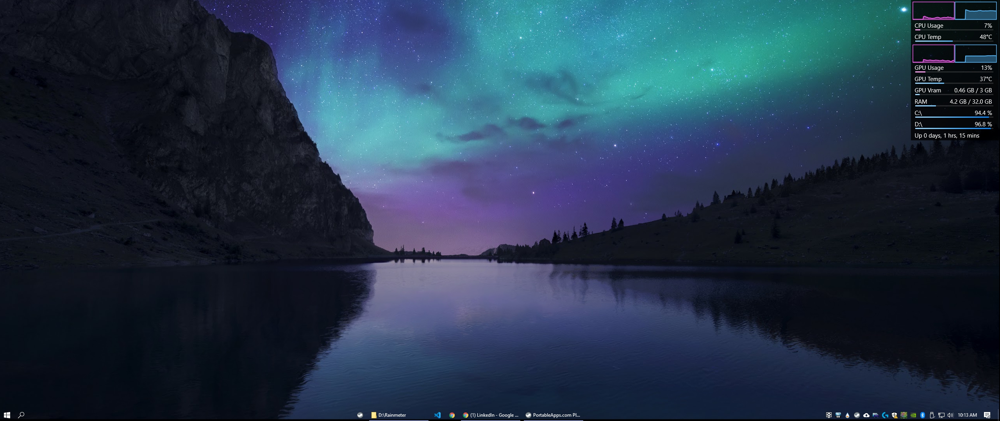

# My custom Rainmeter skin

[Rainmeter](https://www.rainmeter.net/) custom skin - requires [HwInfo](https://www.hwinfo.com/)

Wallpaper from [Wallpaper engine](https://steamcommunity.com/sharedfiles/filedetails/?id=2108388008)

Taskbar from [TaskbarX](https://github.com/ChrisAnd1998/TaskbarX)

  
